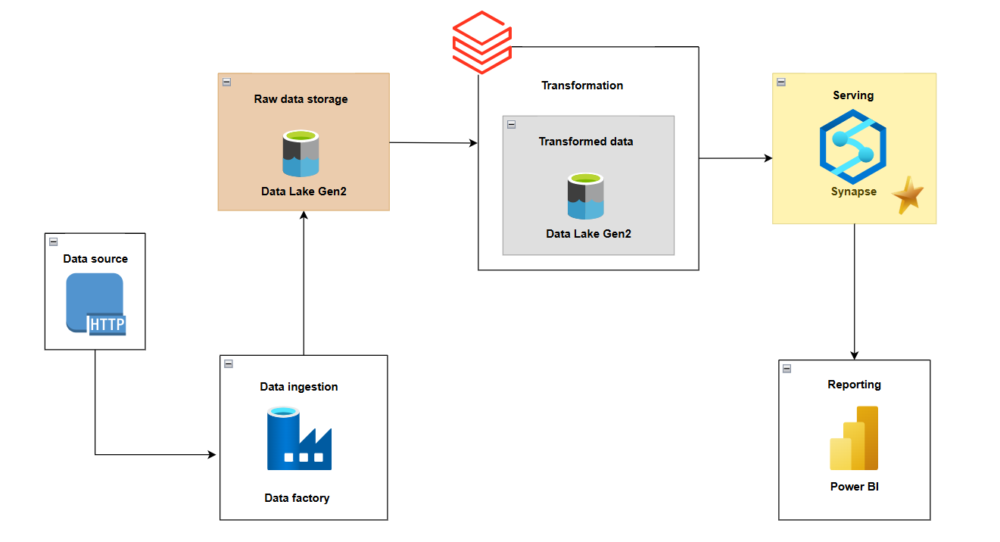

# Azure-Data-Engineering-Project

End-to-end **ETL Data Pipeline** built on **Microsoft Azure**, covering **data ingestion**, **transformation**, and **serving layers**,modeled using a Star Schema within the Medallion Architecture (Bronze, Silver, Gold) framework.

---

## 🧩 Project Overview
-This project demonstrates a complete ETL workflow using:

Azure Data Factory (ADF) → Data ingestion from an external HTTP source into Azure Data Lake Gen2 (Bronze Layer).

Azure Databricks (PySpark) → Data cleaning, transformation, and aggregation to create curated datasets (Silver Layer).

Azure Synapse Analytics → Modeled a Star Schema with fact and dimension tables for optimized querying and reporting (Gold Layer).

Power BI → Connected to Synapse for data validation and model inspection (no dashboard yet).

---

## 🏗 Architecture


---

## 📂 Repository Structure
```
Azure-Data-Engineering-Project/
│
├── data/AdventureWorks/
├── Documentation/Project_Steps.pdf
├── Databricks/silver_layer.ipynb
├── Synapse-SQL/
│   ├── setup.sql
│   ├── silver.sql
│   └── gold.sql
├── JSON-Git-Parameters/git.json
└── README.md
```
